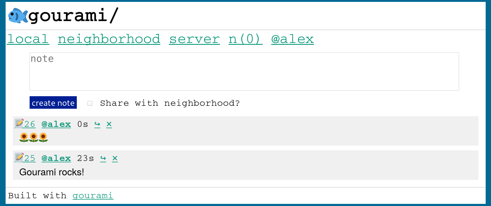

# 🐟gourami: A decentralized social network for the [small web](https://neustadt.fr/essays/the-small-web/), implemented in ActivityPub

An intentionally small, community-focused ultra-lightweight decentralized social network.

## Philosophy and Design

Gourami is...
* **Intentionally small** -- designed to support 50-100 active users. I'm sure it could support more, but things could quickly become a mess. Gourami was hugely and directly inspired by the fantastic essay on [runyourown.social](https://runyourown.social). Gourami is designed to support relatively small communities, maybe tied to a specific interest, community, or physical location.
* **Decentralized** -- Gourami uses [ActivityPub](https://activitypub.rocks/) to federate separate instances, so communities can communicate between instances.
* **Invite-only and private** -- a community curated by the server admin, rather than open to all. Server-local posts are private. 
* **Community, rather than user focused** -- All users share the same timeline(s), and ActivityPub federation occurs on the server, rather than user level. This is somewhat different than how most ActivityPub servers work, and focuses on privacy, community, and locality over easily-shareable public content. 
* **Free and open source** -- Gourami is 100% free and open source, licensed under [AGPL v3](LICENSE).
* **A social network with physical context** -- Gourami should be easy to deploy in a physical space (such as a home, apartment building, coffee shop or [wireless mesh network](https://www.nycmesh.net/)) or among people in a specific physical community, such as a university or town. In *How to Do Nothing*, Jenny Odell discusses the lack of a context, specifically physical and temporal context, in social media, and calls for social networks that are tied to physical space. While Gourami does not force you to tie a deployment to a place, it is designed in such a way that such a deployment would be relatively easy.
* **Extremely lightweight & fast** -- very little Javascript, plain text, small page sizes. Should run on extremely lightweight/cheap hardware and low-bandwidth networks. 
* **Old-school and [Brutalist](https://brutalist-web.design/)** -- Stark and minimal, the design and interface should emphasize, rather than hide, the underlying building blocks of the web that comprise it. This will give Gourami a feel similar to 90s or 2000s web forums, or Twitter circa 2009. 
* **Simple and feature-averse** -- A simpler Gourami is much easier for me to develop, support and maintain. I want Gourami to be reliable software that people can build communities on top of, and severely limiting the feature set makes that much easier. Once I get Gourami to a certain core feature set, my work will be dedicated to maintenance and care, rather than feature additions. This will allow people to develop long-term, stable social networks, and also develop forks without worrying about losing upstream changes.

*Features that aren't implemented yet:*

* **Mastodon/other AP server interop** -- WIP, with the caveats in the next section.

## Gourami is not (really) part of the "Fediverse"

The Fediverse is a public network of servers that communicate mostly publicly on the open internet. There are advantages to this model, but also disadvantages:

* For the average user, not ideologically motivated, it isn't *that* much different than Twitter, except in terms of the userbase.
* Spam and abuse are constant battles.
* Due to the above and other factors, the Fediverse has tended towards centralization in practice.

Gourami is not anti-fediverse, but it follows a fundamentally different model for decentralization:

* Servers are networked with servers, rather than users with users
* Each server whitelists a small number of servers to federate with
* All posts are shared either to the local instance, or to the neighborhood instances. Nothing is public.

Gourami's model of federation is meant to decentralize not just on the level of architecture, but also on a social level -- where there is no central "fediverse" everyone participates in, but rather your server and the servers you choose to federate with. Gourami intends to mimic real world, physical communities, where a sense of place is restored. 

Interop with other ActivityPub microblogging services is still a goal, but the manner in which servers network together is different than how Mastodon or other services.

## Local Installation

If you're on a Linux environment, the easiest way to get started is with the precompiled binaries. You can find them at the [releases](https://github.com/alexwennerberg/gourami/releases) page. 

If you want to build Gourami yourself --

Make sure you have the following dependencies:

* sqlite3
* libsqlite3-dev
* openssl
* libssl-dev

[Install Rustup](https://doc.rust-lang.org/cargo/getting-started/installation.html) or Cargo.

Clone this repository with `git clone https://github.com/alexwennerberg/gourami` 

Run `cargo install --path .`

### Configuration & getting started

Configuration is done via [dotenv](https://github.com/dotenv-rs/dotenv). For development and testing, the `sample_env` file is good to get started for local testing -- copy it to `.env` in the same directory that you're running gourami.

Run the local server with `gourami run`

To create a user account:

* Run the sql command `insert into registration_keys values ("123")`
* Go to `http://localhost:3030/register?key=123`
* Create an account and log in
* Have fun!

## Deployment

**Gourami is in alpha / development stage.**

I would love if you gave Gourami a shot, but be aware that issues may arise. If you would like to follow or join my server, please reach out to me! I'm also happy to help anyone set up their instance. More information on setting up a server is available in the [admin guide](docs/ADMIN_GUIDE.md).

## References

Many projects inspired my work here, and I want to mention them.

* Jenny Odell's discussion of adding context to social media in *How to Do Nothing*
* https://runyourown.social/
* https://joinmastodon.org/
* https://sourcehut.org/    
* https://100r.co/site/mission.html
* https://solar.lowtechmagazine.com/2020/01/how-sustainable-is-a-solar-powered-website.html
* https://internethealthreport.org/2018/the-internet-uses-more-electricity-than/
* https://www.nycmesh.net/
* [Honk](https://flak.tedunangst.com/post/ActivityPub-as-it-has-been-understood) and Ted Unangst's work with ActivityPub
* https://github.com/rustodon/rustodon
* https://github.com/LemmyNet/lemmy
* https://gemini.circumlunar.space

Logo from https://twemoji.twitter.com/
